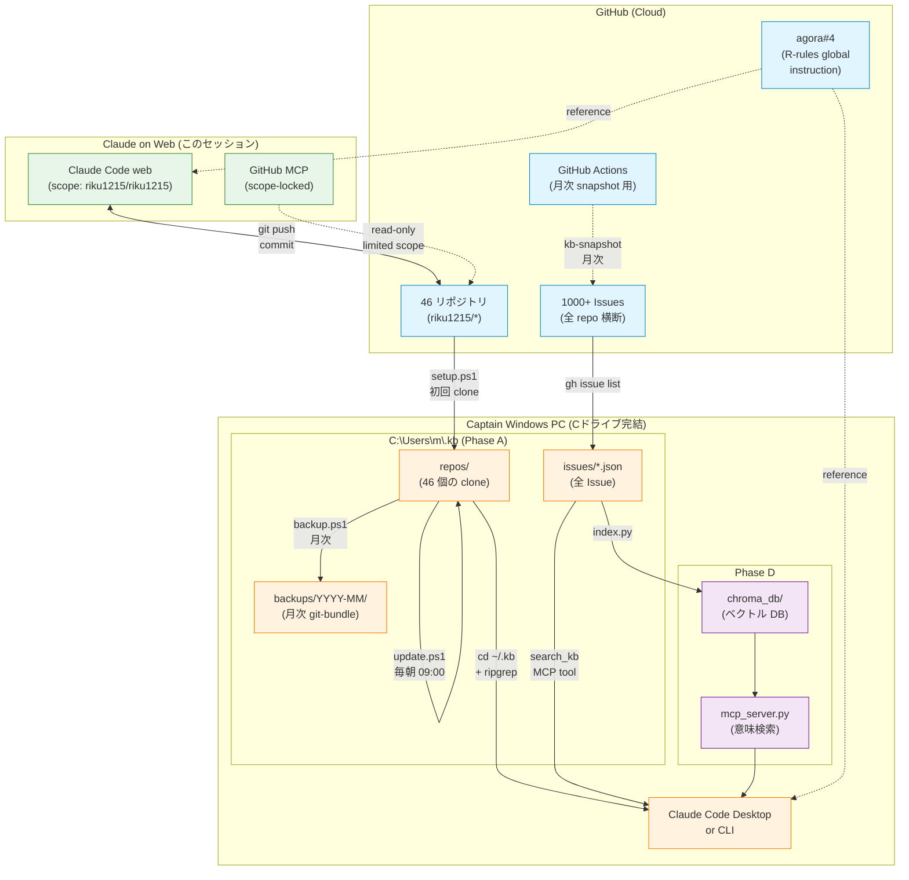

# riku1215 — INDEX

このリポジトリは Captain (キャプテン) のプロフィール・運用基盤を管理する**メタリポ**です。
46 repo を統括する司令塔の役割。

## アーキテクチャ図



**色凡例**: 青 = GitHub クラウド / 橙 = Captain ローカル (Cドライブ) / 紫 = Phase D ベクトル / 緑 = Web Claude

## ファイル構成

| パス | 内容 | 状態 |
|------|------|------|
| `CLAUDE.md` | Claude Code セッション初期設定 (`@PROFILE.md` で import) | 稼働 |
| `PROFILE.md` | キャプテンプロフィール + R-rules + Section 7 失敗パターン + Section 8 KB戦略 | 稼働 |
| `README.md` | リポジトリ説明 (公開向け) | 稼働 |
| `work-prompts/` | plan-first mode (R71) で生成されたタスクプロンプト ×6 | 構築済 |
| `1-knowledge/` | GitHub knowledge をローカル化する Phase A-E 基盤 (PowerShell + bash) | 構築済 |
| `2-intelligence/vector-search/` | Phase D ベクトル検索 (ChromaDB + Ollama + MCP server) | 構築済 |
| `.github/workflows/` | GitHub Actions (月次 cloud backup 等) | 構築済 |

## 進行中タスク (Issues)

| # | タスク | 担当 | 削減/効果 |
|---|--------|------|----------|
| [#4](../../issues/4) | sakura quard-web.jp 会員間移行 | Captain | 二重契約解消 |
| [#5](../../issues/5) | quard-web.jp 公開 (Step 2-4) | Captain + Claude | 自社HP本稼働 |
| [#6](../../issues/6) | PayPal LOPITAL 月¥9k 解約 | Captain | **年¥108,000** |
| [#7](../../issues/7) | GCP 二重課金整理 | Captain | **年¥120,000** |
| [#8](../../issues/8) | pet-care-app PR#52 CI再実行 | Captain + Claude (要scope) | deploy 再開 |
| [#9](../../issues/9) | MCP scope 拡張 / デスクトップ移行 | Captain | 業務継続 |
| [#10](../../issues/10) | ローカル KB 構築 (Phase A) | Captain | **見落とし・手戻り根絶** |

## クイックスタート

### 新規セッション開始時 (Claude Code)

```powershell
cd C:\Users\m\riku1215
git pull
claude
# → CLAUDE.md → @PROFILE.md が自動読込
```

### ローカル KB 構築済の場合 (Phase A 完了後)

```powershell
cd $env:USERPROFILE\.kb
claude
# → 46 repo + 1000+ Issue 全体が context
```

### タスク実行 (work-prompts/)

```powershell
cat work-prompts/01-sakura-domain-migration.md
cat work-prompts/03-paypal-lopital-cancel.md
# etc...
```

## R-rules 参照

詳細は **agora#4** (private、global instruction)。本リポでは PROFILE.md Section 5/6/7/8 に運用要点。

## 2026-05-10 セッション成果サマリ

このリポへのコントリビューションは全て **PR #3** に集約:
- 屋号 QUARD 明記、46 repo 反映
- Section 7 (Claude 失敗パターン恒久化 9項目)
- work-prompts/ (6 タスク自己完結プロンプト)
- 1-knowledge/ (Phase A: クローン+検索+同期)
- 2-intelligence/vector-search/ (Phase D: 意味検索 + MCP server)

完了後、各 Issue で進捗管理。
